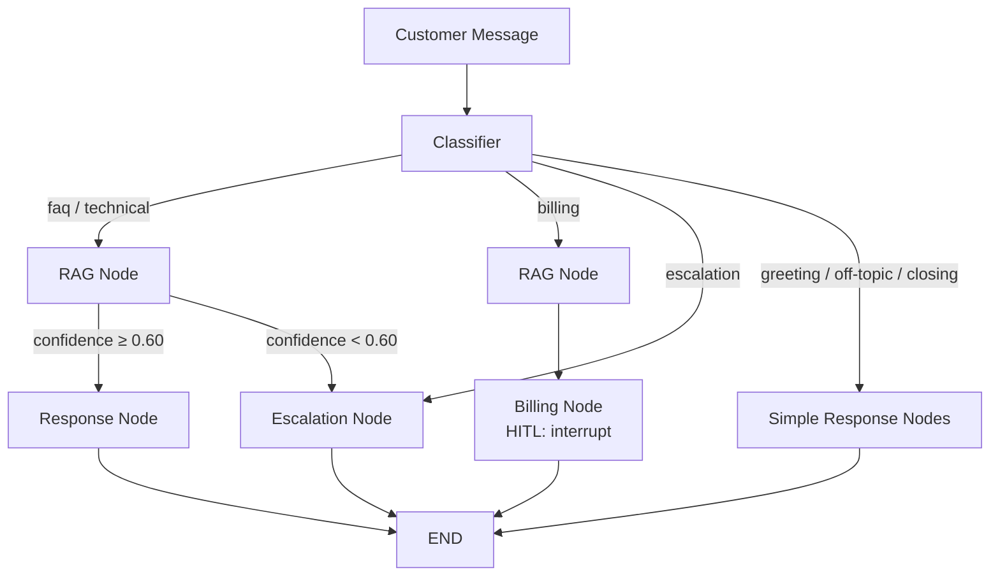

# Customer Support Agent

A domain-agnostic AI-powered customer support agent, demonstrated with **TaskFlow** — a mock SaaS project management platform.

Built with **LangGraph** for agent orchestration, featuring intent classification, conditional routing, RAG-grounded responses, human-in-the-loop approval for billing actions, and automatic escalation for complex issues.

**[Live Demo](https://customer-support-agent-ui.onrender.com)** | **[API Docs](https://customer-support-agent-api.onrender.com/docs)** | **[Blog Post](https://ayushbuilds.hashnode.dev/building-ai-agents-that-know-when-not-to-answer)** | **[Eval Writeup](https://ayushbuilds.hashnode.dev/i-evaluated-my-ai-agent-three-decisions-were-wrong)**

## Architecture



## Key Features

- **Intent Classification**: Structured LLM output with Pydantic `Literal` validation, routing into 7 categories — greeting, faq, technical, billing, escalation, off-topic, and closing
- **RAG-Grounded Responses**: Answers grounded in a 13-doc knowledge base (70 vectors), chunked by markdown headings for semantic coherence
- **Human-in-the-Loop**: Billing actions (refunds, plan changes) pause the graph via `interrupt()` for human approval, rejection, or edit. Reviewers see the full analysis and can modify the customer-facing response before it's sent
- **Confidence-Based Escalation**: Low retrieval confidence automatically routes to human agent instead of risking a hallucinated response
- **Escalation Summaries**: LLM-generated conversation summaries for human agents, with escalation reason tracking (low confidence, customer frustration, direct request)
- **Dual Interface**: Customer chat panel with auto-polling for updates + human reviewer dashboard with clickable thread history and escalation details
- **Evaluation Harness**: 32-case golden dataset with classification, trajectory, HITL, and confidence-based escalation scoring
- **Reliability**: Retry with exponential backoff on all external calls, graceful degradation into escalation on failures — the graph always completes

## Tech Stack

- **Agent Framework**: LangGraph
- **LLM**: GPT-4o (via LangChain)
- **API Layer**: FastAPI
- **Frontend**: Streamlit (multi-page)
- **Vector Store**: Pinecone
- **Embeddings**: OpenAI text-embedding-3-small (1536 dims)
- **Checkpointing**: MemorySaver (dev) — designed for Postgres swap in production
- **Observability**: LangSmith

## Evaluation

The agent is evaluated with a custom harness that tests decisions, not just outputs. Details in the [eval writeup](https://ayushbuilds.hashnode.dev/i-evaluated-my-ai-agent-three-decisions-were-wrong).

### What it measures

| Layer | What's checked | Why it matters |
|-------|---------------|----------------|
| Classification | Does `state.intent` match expected category? | Wrong classification = wrong path through the entire graph |
| Trajectory | Did the agent visit the correct nodes in order? | A correct answer via the wrong path is still a bug (e.g. FAQ question triggering billing HITL) |
| HITL | Did billing interrupt? Did escalation not? | Mixing these up means unnecessary pauses or missing oversight |
| Confidence escalation | Did low RAG confidence redirect to a human? | Prevents hallucinated responses when retrieval is uncertain |

### Golden dataset

32 test cases across three tiers:

- **Happy path (20)**: All 7 classifier categories with 2-4 cases each
- **Edge cases (7)**: Ambiguous inputs, multi-intent, low confidence, category boundaries
- **Adversarial (5)**: Prompt injections, empty input, all-caps rage, non-English (Hindi)

### Results

Initial run exposed three classifier failures: policy questions misclassified as billing actions, a prompt injection reaching the billing node, and multi-intent queries defaulting to lower-risk paths. Three targeted prompt changes fixed all three without architecture changes.

```
Classification Accuracy : 100%
Trajectory Accuracy     : 100%
HITL Accuracy           : 100%
```

### Running evals

```bash
# Full suite, no LLM judge (fast, free)
python -m evals.run_evals --skip-llm-judge

# Single test case
python -m evals.run_evals --id billing_01 --skip-llm-judge

# With LLM-as-judge scoring (requires OPENAI_API_KEY)
python -m evals.run_evals
```

## Reliability

Every node that makes an external call (OpenAI, Pinecone) is wrapped with retry logic and graceful fallback. The design principle: **failures flow into escalation, never into crashes.**

| Failure | What happens | User experience |
|---------|-------------|-----------------|
| Classifier LLM down | Defaults to `escalation` intent | Gets connected to a human |
| Embedding API timeout | Returns empty docs, confidence 0.0 | Existing confidence threshold triggers escalation |
| Pinecone unreachable | Same as above | Same as above |
| Response LLM fails | Sends apology, sets `escalation_reason` | Gets handed off with context |
| Billing LLM fails | Skips HITL, sends "forwarded to billing team" | Request acknowledged, team follows up |
| Escalation summary fails | Builds fallback summary from raw state (no LLM) | Human agent gets basic context |

The escalation node is the last line of defense — it constructs a summary from `state` data without any LLM call if needed, and uses a hardcoded customer message that works regardless of API availability.

## API Endpoints

| Method | Endpoint | Description |
|--------|----------|-------------|
| `POST` | `/chat` | Customer sends a message. Returns response or `pending_review` status if HITL is triggered |
| `GET` | `/pending` | Fetch all threads waiting for human review |
| `POST` | `/review` | Reviewer approves/rejects/edits a pending billing action |
| `GET` | `/threads` | List all conversation threads with status (active, pending_review) |
| `GET` | `/thread/{thread_id}/messages` | Full conversation history for a thread |
| `GET` | `/thread/{thread_id}/state` | Graph state including intent, confidence, escalation reason and summary |
| `GET` | `/` | Health check |

## Project Structure

```
customer-support-agent/
├── backend/
│   ├── nodes/
│   │   ├── classifier.py    # Intent classification (structured output, 7 categories)
│   │   ├── rag.py           # Knowledge base retrieval + confidence scoring
│   │   ├── response.py      # RAG-grounded response generation
│   │   ├── billing.py       # Billing actions + HITL interrupt
│   │   ├── escalation.py    # Escalation summary + handoff
│   │   ├── greeting.py      # Greeting handler
│   │   ├── off_topic.py     # Off-topic deflection
│   │   └── closing.py       # Conversation closing
│   ├── app.py               # FastAPI endpoints
│   ├── graph.py             # LangGraph graph definition + conditional routing
│   ├── state.py             # SupportState schema
│   ├── config.py            # LLM, Pinecone, shared settings
│   ├── reliability.py       # Retry logic, safe wrappers for external calls
│   └── prompts.py           # All system prompts
├── evals/
│   ├── golden_dataset.json  # 32 test cases (happy path, edge, adversarial)
│   ├── run_evals.py         # Eval harness (classification, trajectory, HITL, confidence)
│   └── README.md            # Eval methodology and design decisions
├── frontend/
│   ├── customer_chat.py     # Customer-facing chat UI with polling
│   └── agent_dashboard.py   # Reviewer dashboard with thread history
├── knowledge_base/
│   └── docs/                # 13 TaskFlow product docs (markdown)
├── scripts/
│   └── ingest.py            # Chunk by headings, embed, upsert to Pinecone
├── streamlit_app.py         # Multi-page Streamlit entry point
├── .env.example
└── README.md
```

## Setup

1. Clone the repo:
   ```bash
   git clone https://github.com/octavian115/customer-support-agent.git
   cd customer-support-agent
   ```

2. Install dependencies:
   ```bash
   uv sync
   ```

3. Create `.env` from `.env.example` and add your API keys:
   ```bash
   cp .env.example .env
   ```

4. Create a Pinecone index:
   - Name: `taskflow-support`
   - Dimensions: `1536`
   - Metric: `cosine`

5. Ingest the knowledge base:
   ```bash
   uv run python scripts/ingest.py
   ```

6. Run the API (terminal 1):
   ```bash
   uv run uvicorn backend.app:app --reload
   ```

7. Run the frontend (terminal 2):
   ```bash
   uv run streamlit run streamlit_app.py
   ```

## Architecture Notes

- **Domain-agnostic design**: The agent architecture (classify → route → act → gate) is independent of the mock product. Swapping TaskFlow for any other domain requires only changing the knowledge base docs and classifier categories.
- **State as communication**: Nodes don't call each other directly. All data flows through `SupportState` — each node reads what it needs and writes its output. This makes nodes independently testable and replaceable.
- **Graduated autonomy pattern**: FAQ and technical queries are handled autonomously. Billing actions require human approval. Escalations hand off entirely. This mirrors how production support agents are deployed in industry.
- **Failures degrade, never crash**: Every external call retries with backoff. If retries are exhausted, the node produces a fallback that routes through existing escalation paths. The graph always completes and the customer always gets a response.