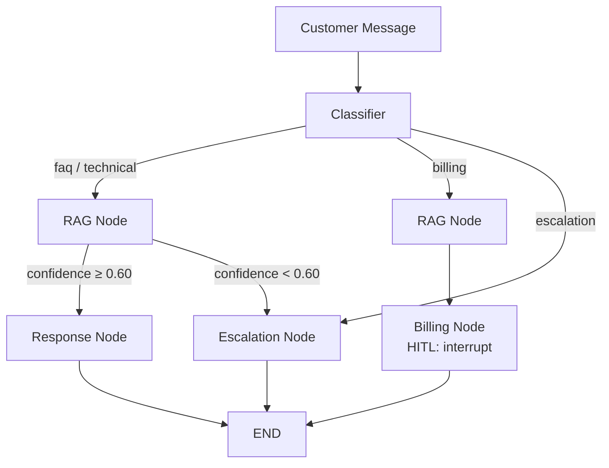

# Customer Support Agent

A domain-agnostic AI-powered customer support agent, demonstrated with **TaskFlow** — a mock SaaS project management platform.

Built with **LangGraph** for agent orchestration, featuring intent classification, conditional routing, RAG-grounded responses, human-in-the-loop approval for billing actions, and automatic escalation for complex issues.

## Architecture



## Key Features

- **Intent Classification**: Structured LLM output with Pydantic validation, routing into faq, technical, billing, or escalation paths
- **RAG-Grounded Responses**: Answers grounded in a 13-doc knowledge base (70 vectors), chunked by markdown headings for semantic coherence
- **Human-in-the-Loop**: Billing actions (refunds, plan changes) pause the graph via `interrupt()` for human approval, rejection, or edit
- **Confidence-Based Escalation**: Low retrieval confidence automatically routes to human agent instead of risking a hallucinated response
- **Dual Interface**: Customer chat panel with auto-polling for updates + human reviewer dashboard with clickable thread history

## Tech Stack

- **Agent Framework**: LangGraph
- **LLM**: GPT-4o (via LangChain)
- **API Layer**: FastAPI
- **Frontend**: Streamlit (multi-page)
- **Vector Store**: Pinecone
- **Embeddings**: OpenAI text-embedding-3-small (1536 dims)
- **Checkpointing**: MemorySaver (dev) — designed for Postgres swap in production
- **Observability**: LangSmith

## API Endpoints

| Method | Endpoint | Description |
|--------|----------|-------------|
| `POST` | `/chat` | Customer sends a message. Returns response or `pending_review` status if HITL is triggered |
| `GET` | `/pending` | Fetch all threads waiting for human review |
| `POST` | `/review` | Reviewer approves/rejects/edits a pending billing action |
| `GET` | `/threads` | List all conversation threads with status (active, pending_review) |
| `GET` | `/thread/{thread_id}/messages` | Full conversation history for a thread |
| `GET` | `/` | Health check |

## Project Structure

```
customer-support-agent/
├── backend/
│   ├── nodes/
│   │   ├── classifier.py    # Intent classification (structured output)
│   │   ├── rag.py           # Knowledge base retrieval + confidence scoring
│   │   ├── response.py      # RAG-grounded response generation
│   │   ├── billing.py       # Billing actions + HITL interrupt
│   │   └── escalation.py    # Escalation summary + handoff
│   ├── app.py               # FastAPI endpoints
│   ├── graph.py             # LangGraph graph definition + conditional routing
│   ├── state.py             # SupportState schema
│   ├── config.py            # LLM, Pinecone, shared settings
│   └── prompts.py           # All system prompts
├── frontend/
│   ├── customer_chat.py     # Customer-facing chat UI with polling
│   └── agent_dashboard.py   # Reviewer dashboard with thread history
├── knowledge_base/
│   └── docs/                # 13 TaskFlow product docs (markdown)
├── scripts/
│   └── ingest.py            # Chunk by headings, embed, upsert to Pinecone
├── streamlit_app.py         # Multi-page Streamlit entry point
├── .env.example
└── README.md
```

## Setup

1. Clone the repo:
   ```bash
   git clone https://github.com/octavian115/customer-support-agent.git
   cd customer-support-agent
   ```

2. Install dependencies:
   ```bash
   uv sync
   ```

3. Create `.env` from `.env.example` and add your API keys:
   ```bash
   cp .env.example .env
   ```

4. Create a Pinecone index:
   - Name: `taskflow-support`
   - Dimensions: `1536`
   - Metric: `cosine`

5. Ingest the knowledge base:
   ```bash
   uv run python scripts/ingest.py
   ```

6. Run the API (terminal 1):
   ```bash
   uv run uvicorn backend.app:app --reload
   ```

7. Run the frontend (terminal 2):
   ```bash
   uv run streamlit run streamlit_app.py
   ```

## Architecture Notes

- **Domain-agnostic design**: The agent architecture (classify → route → act → gate) is independent of the mock product. Swapping TaskFlow for any other domain requires only changing the knowledge base docs and classifier categories.
- **State as communication**: Nodes don't call each other directly. All data flows through `SupportState` — each node reads what it needs and writes its output. This makes nodes independently testable and replaceable.
- **Graduated autonomy pattern**: FAQ and technical queries are handled autonomously. Billing actions require human approval. Escalations hand off entirely. This mirrors how production support agents are deployed in industry.